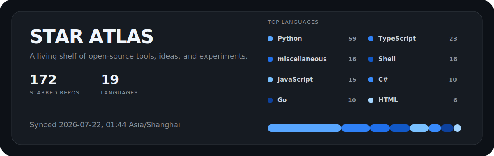

  

<h1 align="center">IGuanggg's open-source shelf</h1>

Useful tools, sharp ideas, and projects worth returning to. Refreshed automatically every day.

  
  
  

## Highlights

<table>
<thead><tr><th align="left">New to the shelf</th><th align="left">Community favorites</th></tr></thead>
<tbody><tr><td width="58%" valign="top"><strong><a href="https://github.com/Goochbeater/Spiritual-Spell-Red-Teaming">Goochbeater/Spiritual-Spell-Red-Teaming</a></strong> 
A repo for jailbreaking various LLMs, mainly Claude 
  <code>&#9733; 2.7K | Fork 550 | miscellaneous</code></td><td width="42%" valign="top"><strong><a href="https://github.com/openclaw/openclaw">openclaw/openclaw</a></strong> 
Your own personal AI assistant. Any OS. Any Platform. The lobster way. 🦞 
  <code>&#9733; 384K | Fork 80.7K | TypeScript</code></td></tr>
<tr><td width="58%" valign="top"><strong><a href="https://github.com/linyqh/NarratoAI">linyqh/NarratoAI</a></strong> 
利用 AI 大模型，一键解说并剪辑视频 
  <code>&#9733; 10.4K | Fork 1.4K | Python</code></td><td width="42%" valign="top"><strong><a href="https://github.com/langgenius/dify">langgenius/dify</a></strong> 
Build Agentic workflows, RAG pipelines, with rich AI model and tool support on one collab... 
  <code>&#9733; 150.1K | Fork 23.7K | TypeScript</code></td></tr>
<tr><td width="58%" valign="top"><strong><a href="https://github.com/POf-L/Fanqie-novel-Downloader">POf-L/Fanqie-novel-Downloader</a></strong> 
🍅 番茄小说下载器 | 支持Windows/macOS/Linux/android 
  <code>&#9733; 1.3K | Fork 309 | Python</code></td><td width="42%" valign="top"><strong><a href="https://github.com/ChatGPTNextWeb/NextChat">ChatGPTNextWeb/NextChat</a></strong> 
✨ Light and Fast AI Assistant. Support: Web | iOS | MacOS | Android | Linux | Windows 
  <code>&#9733; 88.5K | Fork 59.4K | TypeScript</code></td></tr>
<tr><td width="58%" valign="top"><strong><a href="https://github.com/t59688/arboris-novel">t59688/arboris-novel</a></strong> 
AI 写作伙伴，点亮你的创作灵感 
  <code>&#9733; 1.5K | Fork 328 | Python</code></td><td width="42%" valign="top"><strong><a href="https://github.com/nexu-io/open-design">nexu-io/open-design</a></strong> 
🎨 The open-source Claude Design alternative. 🖥️ Local-first desktop app. 🖼️ Your codin... 
  <code>&#9733; 81.3K | Fork 9.4K | TypeScript</code></td></tr>
<tr><td width="58%" valign="top"><strong><a href="https://github.com/dimthink/PriceAI">dimthink/PriceAI</a></strong> 
AI 订阅卡网渠道比价工具：聚合100+卡网渠道包含 ChatGPT、Claude、Gemini、Grok 等多渠道报价，展示有货最低价、库存状态和原站购买链接。 
  <code>&#9733; 2.3K | Fork 134 | TypeScript</code></td><td width="42%" valign="top"><strong><a href="https://github.com/ventoy/Ventoy">ventoy/Ventoy</a></strong> 
A new bootable USB solution. 
  <code>&#9733; 78.2K | Fork 4.9K | C</code></td></tr>
<tr><td width="58%" valign="top"><strong><a href="https://github.com/IvanLi-CN/tavily-hikari">IvanLi-CN/tavily-hikari</a></strong> 
No description provided. 
  <code>&#9733; 319 | Fork 47 | Rust</code></td><td width="42%" valign="top"><strong><a href="https://github.com/NanmiCoder/MediaCrawler">NanmiCoder/MediaCrawler</a></strong> 
小红书笔记 | 评论爬虫、抖音视频 | 评论爬虫、快手视频 | 评论爬虫、B 站视频 ｜ 评论爬虫、微博帖子 ｜ 评论爬虫、百度贴吧帖子 ｜ 百度贴吧评论回复爬虫 | 知乎问答文... 
  <code>&#9733; 57.2K | Fork 11.4K | Python</code></td></tr></tbody>
</table>

### Active this week

## Language Index

## All Stars

<strong>Python</strong> <code>59 repos</code>

<table>
<tr><td width="50%" valign="top"><strong><a href="https://github.com/linyqh/NarratoAI">linyqh/NarratoAI</a></strong> 
利用 AI 大模型，一键解说并剪辑视频 
  <code>&#9733; 10.4K | Fork 1.4K | Python</code> #aiagent #aiops #gemini-api</td><td width="50%" valign="top"><strong><a href="https://github.com/POf-L/Fanqie-novel-Downloader">POf-L/Fanqie-novel-Downloader</a></strong> 
🍅 番茄小说下载器 | 支持Windows/macOS/Linux/android 
  <code>&#9733; 1.3K | Fork 309 | Python</code> #android #chinese-novel #ebook</td></tr>
<tr><td width="50%" valign="top"><strong><a href="https://github.com/t59688/arboris-novel">t59688/arboris-novel</a></strong> 
AI 写作伙伴，点亮你的创作灵感 
  <code>&#9733; 1.5K | Fork 328 | Python</code> #ai #novel</td><td width="50%" valign="top"><strong><a href="https://github.com/dama-cyber/Casting-Workflow">dama-cyber/Casting-Workflow</a></strong> 
No description provided. 
  <code>&#9733; 478 | Fork 95 | Python</code></td></tr>
<tr><td width="50%" valign="top"><strong><a href="https://github.com/LING71671/open-reverselab">LING71671/open-reverselab</a></strong> 
Agent-native reverse-engineering lab with a 197-article knowledge base, MCP tools, and CTF/APK/PE automation workflows.[有通用AI越狱bug😂😉] 
  <code>&#9733; 893 | Fork 233 | Python</code> #ai-agent #android-reverse-engineering #binary-analysis</td><td width="50%" valign="top"><strong><a href="https://github.com/Jia-Ethan/codex-keysmith">Jia-Ethan/codex-keysmith</a></strong> 
Version-independent Codex instruction deployment with dry-run, backups, hook isolation, and recovery. 
  <code>&#9733; 1.7K | Fork 277 | Python</code> #cli #codex #codex-cli</td></tr>
<tr><td width="50%" valign="top"><strong><a href="https://github.com/shenminglinyi/PlotPilot">shenminglinyi/PlotPilot</a></strong> 
【墨枢】作者的领航员 
  <code>&#9733; 1.3K | Fork 418 | Python</code></td><td width="50%" valign="top"><strong><a href="https://github.com/ShadowHackrs/gmail-account-creator">ShadowHackrs/gmail-account-creator</a></strong> 
🚀 Advanced automated Gmail account creation tool with anti-detection, phone verification bypass, 5sim integration, and beautiful modern interface.... 
  <code>&#9733; 3.7K | Fork 613 | Python</code></td></tr>
<tr><td width="50%" valign="top"><strong><a href="https://github.com/tiantianGPU/reg-factory">tiantianGPU/reg-factory</a></strong> 
天天中转站 
  <code>&#9733; 1.6K | Fork 649 | Python</code></td><td width="50%" valign="top"><strong><a href="https://github.com/basketikun/chatgpt2api">basketikun/chatgpt2api</a></strong> 
ChatGPT官网接口纯协议的逆向实现，支持GPT-Image-2模型、文本模型，兼容OpenAI接口协议，在线批量生图/编辑图，号池管理，支持可编辑PPT/PSD文件逆向，支持导入CPA、sub2api号池 、支持接入Cherry Studio、New Api 等软件 
  <code>&#9733; 5.3K | Fork 1.5K | Python</code></td></tr>
<tr><td width="50%" valign="top"><strong><a href="https://github.com/KingJin-web/zy">KingJin-web/zy</a></strong> 
No description provided. 
  <code>&#9733; 130 | Fork 27 | Python</code></td><td width="50%" valign="top"><strong><a href="https://github.com/hero8152/Infinite-Canvas">hero8152/Infinite-Canvas</a></strong> 
Supports comfyui/API calls/modelscope calls 
  <code>&#9733; 2.4K | Fork 466 | Python</code></td></tr>
<tr><td width="50%" valign="top"><strong><a href="https://github.com/pheohu-42/Claude_zh-CN_LanguagePack">pheohu-42/Claude_zh-CN_LanguagePack</a></strong> 
No description provided. 
  <code>&#9733; 335 | Fork 16 | Python</code></td><td width="50%" valign="top"><strong><a href="https://github.com/hugohe3/ppt-master">hugohe3/ppt-master</a></strong> 
AI turns documents or topics into real, native PowerPoint decks-with native shapes, transitions and animations, data-backed charts and tables on de... 
  <code>&#9733; 41K | Fork 3.4K | Python</code> #ai-agent #aippt #office</td></tr>
<tr><td width="50%" valign="top"><strong><a href="https://github.com/ZeroPointSix/outlookEmailPlus">ZeroPointSix/outlookEmailPlus</a></strong> 
Outlookmail Plus: Designed Specifically for Registration | Outlookmail Plus：专为注册而生 | 
  <code>&#9733; 1.8K | Fork 352 | Python</code></td><td width="50%" valign="top"><strong><a href="https://github.com/foryourhealth111-pixel/Vibe-Skills">foryourhealth111-pixel/Vibe-Skills</a></strong> 
VibeSkills is a general-purpose Skill that automatically routes local Skills and intelligently orchestrates harness workflows. 
  <code>&#9733; 2.5K | Fork 181 | Python</code> #agent-framework #agent-skills #agentic-coding</td></tr>
<tr><td width="50%" valign="top"><strong><a href="https://github.com/cft0808/edict">cft0808/edict</a></strong> 
🏛️ 三省六部制 | OpenClaw Multi-Agent Orchestration System - 9 specialized AI agents with real-time dashboard, model config, and full audit trails 
  <code>&#9733; 16.3K | Fork 1.7K | Python</code> #ai-agents #ai-orchestration #autonomous-agents</td><td width="50%" valign="top"><strong><a href="https://github.com/jundot/omlx">jundot/omlx</a></strong> 
LLM inference server with continuous batching &amp; SSD caching for Apple Silicon - managed from the macOS menu bar 
  <code>&#9733; 18.1K | Fork 1.5K | Python</code> #apple-silicon #inference-server #llm</td></tr>
<tr><td width="50%" valign="top"><strong><a href="https://github.com/wujunwei928/parse-video-py">wujunwei928/parse-video-py</a></strong> 
Python短视频去水印爬虫：抖音,皮皮虾,火山,微视,最右,快手,全民小视频,皮皮搞笑,西瓜视频,虎牙,梨视频,acfun,好看视频... 
  <code>&#9733; 661 | Fork 174 | Python</code> #python #spider #video</td><td width="50%" valign="top"><strong><a href="https://github.com/Cat-zaizai/ZaiZaiCat-Checkin">Cat-zaizai/ZaiZaiCat-Checkin</a></strong> 
每日签到脚本(多账号),青龙脚本,签到脚本,签到列表: 🚚 顺丰速运 | 恩山论坛 | 看雪论坛 | 上海杨浦 | 华润通 | 鸿星尔克 | WPS签到 | 什么值得买 
  <code>&#9733; 406 | Fork 57 | Python</code> #checkin #python #qinglong</td></tr>
<tr><td width="50%" valign="top"><strong><a href="https://github.com/HisMax/RedInk">HisMax/RedInk</a></strong> 
Red Ink - A one-stop Xiaohongshu image-and-text generator based on the 🍌Nano Banana Pro🍌, &quot;One Sentence, One Image: Generate Xiaohongshu Text and... 
  <code>&#9733; 5.4K | Fork 1K | Python</code> #ai #aigc #content-generator</td><td width="50%" valign="top"><strong><a href="https://github.com/aoguai/LiYing">aoguai/LiYing</a></strong> 
LiYing is an automated photo processing program designed for automating the post-processing workflow of ID photos in general photo studios. | LiYin... 
  <code>&#9733; 3.2K | Fork 271 | Python</code> #background-replacement #image-compression #image-cropping</td></tr>
<tr><td width="50%" valign="top"><strong><a href="https://github.com/WEIFENG2333/VideoCaptioner">WEIFENG2333/VideoCaptioner</a></strong> 
🎬 卡卡字幕助手 | VideoCaptioner - 基于 LLM 的智能字幕助手 - 视频字幕生成、断句、校正、字幕翻译全流程处理！- A powered tool for easy and efficient video subtitling. 
  <code>&#9733; 15.4K | Fork 1.3K | Python</code> #ai #subtitle #translate</td><td width="50%" valign="top"><strong><a href="https://github.com/snailyp/gemini-balance">snailyp/gemini-balance</a></strong> 
Gemini polling proxy service （gemini轮询代理服务） 
  <code>&#9733; 5.8K | Fork 1.2K | Python</code> #gemini #gemini-api #googlesearch</td></tr>
<tr><td width="50%" valign="top"><strong><a href="https://github.com/kuangdd2024/auto-video-generateor">kuangdd2024/auto-video-generateor</a></strong> 
自动视频生成器，给定主题，自动生成解说视频。用户输入主题文字，系统调用大语言模型生成故事或解说的文字，然后进一步调用语音合成接口生成解说的语音，调用文生图接口生成契合文字内容的配图，最后融合语音和配图生成解说视频。 
  <code>&#9733; 888 | Fork 173 | Python</code></td><td width="50%" valign="top"><strong><a href="https://github.com/hunshcn/gh-proxy">hunshcn/gh-proxy</a></strong> 
github release、archive以及项目文件的加速项目 
  <code>&#9733; 8.9K | Fork 2.4K | Python</code></td></tr>
<tr><td width="50%" valign="top"><strong><a href="https://github.com/dreammis/social-auto-upload">dreammis/social-auto-upload</a></strong> 
自动化上传视频到社交媒体：抖音、小红书、视频号、tiktok、youtube、bilibili 
  <code>&#9733; 13.7K | Fork 2.4K | Python</code> #bilibili #douyin #tiktok</td><td width="50%" valign="top"><strong><a href="https://github.com/JoeanAmier/XHS-Downloader">JoeanAmier/XHS-Downloader</a></strong> 
小红书（XiaoHongShu、RedNote）链接提取/作品采集工具：提取账号发布、收藏、点赞、专辑作品链接；提取搜索结果作品、用户链接；采集小红书作品信息；提取小红书作品下载地址；下载小红书作品文件 
  <code>&#9733; 12.1K | Fork 1.8K | Python</code> #api #docker #downloader</td></tr>
<tr><td width="50%" valign="top"><strong><a href="https://github.com/AstrBotDevs/AstrBot">AstrBotDevs/AstrBot</a></strong> 
AI Agent Assistant &amp; development framework that integrates lots of IM platforms, LLMs, plugins and AI feature, and can be your openclaw alternative. ✨ 
  <code>&#9733; 38K | Fork 2.7K | Python</code> #agent #ai #astrbot</td><td width="50%" valign="top"><strong><a href="https://github.com/Zeyi-Lin/HivisionIDPhotos">Zeyi-Lin/HivisionIDPhotos</a></strong> 
⚡️HivisionIDPhotos: a lightweight and efficient AI ID photos tools. 一个轻量级的AI证件照制作算法。 
  <code>&#9733; 21.3K | Fork 2.4K | Python</code> #cnn #demo #docker</td></tr>
<tr><td width="50%" valign="top"><strong><a href="https://github.com/mli/autocut">mli/autocut</a></strong> 
用文本编辑器剪视频 
  <code>&#9733; 7.8K | Fork 822 | Python</code></td><td width="50%" valign="top"><strong><a href="https://github.com/AKA-Cigma/qinglong-backup">AKA-Cigma/qinglong-backup</a></strong> 
将青龙的基本配置文件及脚本备份至阿里网盘&amp;阿里网盘自动签到 
  <code>&#9733; 39 | Fork 10 | Python</code></td></tr>
<tr><td width="50%" valign="top"><strong><a href="https://github.com/lazykitty2026/deepsea">lazykitty2026/deepsea</a></strong> 
☆青龙面板脚本更新自用可用薅羊毛库☆【美团自动领神券优惠券☆顺丰速运签到☆小米运动自动刷步数（微信/支付宝）】 
  <code>&#9733; 202 | Fork 25 | Python</code></td><td width="50%" valign="top"><strong><a href="https://github.com/Evil0ctal/Douyin_TikTok_Download_API">Evil0ctal/Douyin_TikTok_Download_API</a></strong> 
🚀「Douyin_TikTok_Download_API」是一个开箱即用的高性能异步抖音、快手、TikTok、Bilibili数据爬取工具，支持API调用，在线批量解析及下载。 
  <code>&#9733; 19K | Fork 2.7K | Python</code> #api #async #crawler</td></tr>
<tr><td width="50%" valign="top"><strong><a href="https://github.com/budtmo/docker-android">budtmo/docker-android</a></strong> 
Android in docker solution with noVNC supported and video recording 
  <code>&#9733; 15.6K | Fork 1.7K | Python</code> #alibabacloud #android #android-emulator</td><td width="50%" valign="top"><strong><a href="https://github.com/wd210010/only_for_happly">wd210010/only_for_happly</a></strong> 
manus自动写脚本 注册链接 https://manus.im/invitation/V9OIRPDYST3RAF8 1元机场 http://b.u9v.cn/dVMss 百度贴吧签到★小米运动刷步数★恩山签到★雨云签到白嫖服务器★小茅预约★天翼云盘签到★阿里云盘签到★富贵论坛签到★一点万向... 
  <code>&#9733; 1.4K | Fork 156 | Python</code></td></tr>
<tr><td width="50%" valign="top"><strong><a href="https://github.com/chendbdb/qinglong">chendbdb/qinglong</a></strong> 
青龙面板所使用的脚本，全部个人制作的，且开源 
  <code>&#9733; 153 | Fork 15 | Python</code></td><td width="50%" valign="top"><strong><a href="https://github.com/Cp0204/ChinaTelecomMonitor">Cp0204/ChinaTelecomMonitor</a></strong> 
中国电信 话费、通话、流量 套餐用量监控，支持青龙，支持 Docker 部署成 API 服务。 
  <code>&#9733; 314 | Fork 41 | Python</code> #docker #qinglong #telecom</td></tr>
<tr><td width="50%" valign="top"><strong><a href="https://github.com/oiov/u2b">oiov/u2b</a></strong> 
好耶！是哔哩哔哩投稿姬，只需一行命令搬运YouTube视频到B站～ 
  <code>&#9733; 31 | Fork 8 | Python</code></td><td width="50%" valign="top"><strong><a href="https://github.com/assassinliujie/youtube2bilibili">assassinliujie/youtube2bilibili</a></strong> 
油管视频/频道 一键搬运到b站脚本 
  <code>&#9733; 53 | Fork 14 | Python</code></td></tr>
<tr><td width="50%" valign="top"><strong><a href="https://github.com/jiran214/langup-ai">jiran214/langup-ai</a></strong> 
AGI 社交网络 Bot. BiliBili | 直播聊天数字人 | 视频@自动回复 | 私信bot | 终端聊天 | 语音交互 
  <code>&#9733; 728 | Fork 128 | Python</code> #bilibili #bot #chatgpt</td><td width="50%" valign="top"><strong><a href="https://github.com/smallnew666/ChatGPT-Virtual-Live">smallnew666/ChatGPT-Virtual-Live</a></strong> 
ChatGPT虚拟主播、支持B站、抖音、视频号 
  <code>&#9733; 299 | Fork 66 | Python</code></td></tr>
<tr><td width="50%" valign="top"><strong><a href="https://github.com/jackvale/rectg">jackvale/rectg</a></strong> 
Telegram 中文频道、群组与机器人精选索引，结合自动化抓取与人工整理，支持在线搜索与分类浏览。 
  <code>&#9733; 9.1K | Fork 529 | Python</code> #open-data #telegram #telegram-bot</td><td width="50%" valign="top"><strong><a href="https://github.com/JoeanAmier/TikTokDownloader">JoeanAmier/TikTokDownloader</a></strong> 
TikTok 发布/喜欢/合辑/直播/视频/图集/音乐；抖音发布/喜欢/收藏/收藏夹/视频/图集/实况/直播/音乐/合集/评论/账号/搜索/热榜数据采集工具/下载工具 
  <code>&#9733; 15.2K | Fork 2.6K | Python</code> #api #csv #docker</td></tr>
<tr><td width="50%" valign="top"><strong><a href="https://github.com/cyubuchen/Free_Proxy_Website">cyubuchen/Free_Proxy_Website</a></strong> 
获取免费socks/https/http代理的网站集合 
  <code>&#9733; 685 | Fork 129 | Python</code> #crawler #free-proxy-list #ip</td><td width="50%" valign="top"><strong><a href="https://github.com/NanmiCoder/MediaCrawler">NanmiCoder/MediaCrawler</a></strong> 
小红书笔记 | 评论爬虫、抖音视频 | 评论爬虫、快手视频 | 评论爬虫、B 站视频 ｜ 评论爬虫、微博帖子 ｜ 评论爬虫、百度贴吧帖子 ｜ 百度贴吧评论回复爬虫 | 知乎问答文章｜评论爬虫 
  <code>&#9733; 57.2K | Fork 11.4K | Python</code></td></tr>
<tr><td width="50%" valign="top"><strong><a href="https://github.com/linbailo/zyqinglong">linbailo/zyqinglong</a></strong> 
青龙面板脚本自用库薅羊毛（✅ 滴滴出行领券✅ 滴滴加油领券✅ 滴滴代驾领券/滴滴签到领券打卡✅ 滴滴果园✅ mt论坛✅ 美团✅ 饿了么✅ 得物✅ 顺丰✅ 霸王茶姬✅ 益禾堂✅ 塔斯汀✅ 海底捞） 
  <code>&#9733; 1.9K | Fork 219 | Python</code></td><td width="50%" valign="top"><strong><a href="https://github.com/CHERWING/CHERWIN_SCRIPTS">CHERWING/CHERWIN_SCRIPTS</a></strong> 
永辉生活脚本 | 顺丰速运脚本 | 朴朴超市脚本 | 统一茄皇脚本 | 海底捞小程序脚本 | 口味王会员中心小程序脚本 | 霸王茶姬小程序脚本 | 奈雪点单小程序脚本 | 卡夫亨氏新厨艺公众号脚本 | 韵达快递小程序脚本 | 中通快递小程序脚本 | 德邦快递小程序脚本 | 极兔速递小程序脚本... 
  <code>&#9733; 817 | Fork 189 | Python</code></td></tr>
<tr><td width="50%" valign="top"><strong><a href="https://github.com/huaji8/huajiScript">huaji8/huajiScript</a></strong> 
滑稽の青龙脚本库 
  <code>&#9733; 814 | Fork 87 | Python</code> #javascript #luguan #python-script</td><td width="50%" valign="top"><strong><a href="https://github.com/jxxghp/MoviePilot">jxxghp/MoviePilot</a></strong> 
NAS媒体库自动化管理工具 
  <code>&#9733; 11.4K | Fork 1.4K | Python</code></td></tr>
<tr><td width="50%" valign="top"><strong><a href="https://github.com/0-8-4/miui-auto-tasks">0-8-4/miui-auto-tasks</a></strong> 
一个自动化完成小米社区任务的脚本 
  <code>&#9733; 1.2K | Fork 213 | Python</code> #docker #miui #python</td><td width="50%" valign="top"><strong><a href="https://github.com/tickmao/Novel">tickmao/Novel</a></strong> 
📚 Novle setting | 小说书源及软件整理 爱阅书香 / 香色闺阁 / 阅读（含字体、净化规则、TTS配置） 
  <code>&#9733; 1.8K | Fork 75 | Python</code> #books #booksource #config</td></tr>
<tr><td width="50%" valign="top"><strong><a href="https://github.com/RaineaAN/GlaDOS_Checkin_ql">RaineaAN/GlaDOS_Checkin_ql</a></strong> 
基于Python实现的GLaDOS自动签到项目。可部署在青龙面板，支持多账号。 
  <code>&#9733; 297 | Fork 102 | Python</code></td><td width="50%" valign="top"><strong><a href="https://github.com/chq09093112/sign_action">chq09093112/sign_action</a></strong> 
百度爱奇艺B站自动签到 
  <code>&#9733; 33 | Fork 15 | Python</code></td></tr>
<tr><td width="50%" valign="top"><strong><a href="https://github.com/KD-happy/KDCheckin">KD-happy/KDCheckin</a></strong> 
多个网站签到、软件签到（支持单个签到、集合签到、多人签到），适用于青龙、云函数、本地 
  <code>&#9733; 313 | Fork 40 | Python</code> #qinglong</td><td width="50%" valign="top"><strong><a href="https://github.com/sunflo/smzdm_sign_bot">sunflo/smzdm_sign_bot</a></strong> 
张大妈自签到脚本，需搭配青龙面板使用 
  <code>&#9733; 105 | Fork 23 | Python</code></td></tr>
<tr><td width="50%" valign="top"><strong><a href="https://github.com/qd-today/qd">qd-today/qd</a></strong> 
QD [v20240210] -- HTTP请求定时任务自动执行框架 base on HAR Editor and Tornado Server 
  <code>&#9733; 5.5K | Fork 659 | Python</code> #checkin #docker #har</td><td width="50%" valign="top"><strong><a href="https://github.com/limoruirui/misaka">limoruirui/misaka</a></strong> 
开源的一些乱七八糟的东西 
  <code>&#9733; 470 | Fork 243 | Python</code></td></tr>
<tr><td colspan="2" valign="top"><strong><a href="https://github.com/zhayujie/CowAgent">zhayujie/CowAgent</a></strong> 
Open-source super AI assistant &amp; Agent Harness. Plans tasks, runs tools and skills, self-evolves with memory and knowledge. Multi-model, multi-chan... 
  <code>&#9733; 46.1K | Fork 10.3K | Python</code> #ai #ai-agent #ai-agents</td></tr>
</table>

<strong>TypeScript</strong> <code>23 repos</code>

<table>
<tr><td width="50%" valign="top"><strong><a href="https://github.com/dimthink/PriceAI">dimthink/PriceAI</a></strong> 
AI 订阅卡网渠道比价工具：聚合100+卡网渠道包含 ChatGPT、Claude、Gemini、Grok 等多渠道报价，展示有货最低价、库存状态和原站购买链接。 
  <code>&#9733; 2.3K | Fork 134 | TypeScript</code> #ai #ai-subscription #chatgpt</td><td width="50%" valign="top"><strong><a href="https://github.com/nexu-io/open-design">nexu-io/open-design</a></strong> 
🎨 The open-source Claude Design alternative. 🖥️ Local-first desktop app. 🖼️ Your coding agent becomes the design engine: prototypes, landing pag... 
  <code>&#9733; 81.3K | Fork 9.4K | TypeScript</code> #agent-skills #ai-agents #ai-design</td></tr>
<tr><td width="50%" valign="top"><strong><a href="https://github.com/basketikun/infinite-canvas">basketikun/infinite-canvas</a></strong> 
面向 AI 创作的开源无限画布工作台，集成 AI 生图、参考图编辑、视频生成、Agent 智能助手、画布编排、对话创作、提示词库与素材管理等能力，支持可视化创作流程与多 Agent 协同工作。兼容 OpenAI 接口生态，支持 chatgpt2api、grok2api、flow2api、new... 
  <code>&#9733; 3.8K | Fork 974 | TypeScript</code></td><td width="50%" valign="top"><strong><a href="https://github.com/langgenius/dify">langgenius/dify</a></strong> 
Build Agentic workflows, RAG pipelines, with rich AI model and tool support on one collaborative workspace. Deploy on cloud, VPC, or self-hosted, s... 
  <code>&#9733; 150.1K | Fork 23.7K | TypeScript</code> #agent #agentic-ai #agentic-framework</td></tr>
<tr><td width="50%" valign="top"><strong><a href="https://github.com/beilunyang/moemail">beilunyang/moemail</a></strong> 
A cute temporary email service built with NextJS + Cloudflare technology stack 🎉 | 一个基于 NextJS + Cloudflare 技术栈构建的可爱临时邮箱服务🎉 
  <code>&#9733; 2.8K | Fork 2.5K | TypeScript</code> #cloudflare #cloudflare-workers #email</td><td width="50%" valign="top"><strong><a href="https://github.com/claude-code-best/claude-code">claude-code-best/claude-code</a></strong> 
原汁原昧 Claude Code 可运行,可构建, 可调试版; 生产级工程化, 企业级可靠性; 安全无毒, 内存泄露修复 
  <code>&#9733; 21.6K | Fork 16.4K | TypeScript</code></td></tr>
<tr><td width="50%" valign="top"><strong><a href="https://github.com/ponponon/claude_code_src">ponponon/claude_code_src</a></strong> 
2026.3.31 claude code 意外把包含源码的文件上传到 npm 仓库，版本号是 2.1.88，其中 cli.js.map 文件有 57MB 的体积，claude code 的源码在该文件的 sourcesContent 字段里面，解压还原后有 70w 行代码 
  <code>&#9733; 2.3K | Fork 3.5K | TypeScript</code></td><td width="50%" valign="top"><strong><a href="https://github.com/tencent-connect/openclaw-qqbot">tencent-connect/openclaw-qqbot</a></strong> 
qqbot 
  <code>&#9733; 1.5K | Fork 193 | TypeScript</code></td></tr>
<tr><td width="50%" valign="top"><strong><a href="https://github.com/BytePioneer-AI/openclaw-china">BytePioneer-AI/openclaw-china</a></strong> 
OpenClaw中国插件：支持飞书，钉钉，QQ，企业微信，微信 
  <code>&#9733; 4K | Fork 343 | TypeScript</code> #openclaw #openclaw-china #openclaw-dingding</td><td width="50%" valign="top"><strong><a href="https://github.com/openclaw/openclaw">openclaw/openclaw</a></strong> 
Your own personal AI assistant. Any OS. Any Platform. The lobster way. 🦞 
  <code>&#9733; 384K | Fork 80.7K | TypeScript</code> #ai #assistant #crustacean</td></tr>
<tr><td width="50%" valign="top"><strong><a href="https://github.com/KuekHaoYang/KVideo">KuekHaoYang/KVideo</a></strong> 
一个基于 Next.js 16 构建的现代化视频聚合播放平台。采用独特的 &quot;Liquid Glass&quot; 设计语言，提供流畅的视觉体验和强大的视频搜索功能。 
  <code>&#9733; 3.9K | Fork 6.7K | TypeScript</code></td><td width="50%" valign="top"><strong><a href="https://github.com/katelya77/KatelyaTV">katelya77/KatelyaTV</a></strong> 
一个基于MoonTV(LunaTV)二次开发的项目。新项目：https://github.com/Decohererk/DecoTV 
  <code>&#9733; 2.9K | Fork 3.5K | TypeScript</code></td></tr>
<tr><td width="50%" valign="top"><strong><a href="https://github.com/lyswhut/lx-music-desktop">lyswhut/lx-music-desktop</a></strong> 
一个基于 Electron 的音乐软件 
  <code>&#9733; 52.3K | Fork 6.9K | TypeScript</code> #electron #javascript #music-player</td><td width="50%" valign="top"><strong><a href="https://github.com/MoonTechLab/LunaTV">MoonTechLab/LunaTV</a></strong> 
本项目采用 CC BY-NC-SA 协议，禁止任何商业化行为，任何衍生项目必须保留本项目地址并以相同协议开源 
  <code>&#9733; 9.1K | Fork 8.8K | TypeScript</code></td></tr>
<tr><td width="50%" valign="top"><strong><a href="https://github.com/dreamhunter2333/cloudflare_temp_email">dreamhunter2333/cloudflare_temp_email</a></strong> 
CloudFlare free temp domain email 免费收发 临时域名邮箱 支持附件 IMAP SMTP TelegramBot 
  <code>&#9733; 11K | Fork 7.4K | TypeScript</code> #cloudflare-email #cloudflare-pages #cloudflare-workers</td><td width="50%" valign="top"><strong><a href="https://github.com/ourongxing/newsnow">ourongxing/newsnow</a></strong> 
Elegant reading of real-time and hottest news 
  <code>&#9733; 21.2K | Fork 5.9K | TypeScript</code> #elegant #news</td></tr>
<tr><td width="50%" valign="top"><strong><a href="https://github.com/xxss0903/drawstamputils">xxss0903/drawstamputils</a></strong> 
Draw Stamp Utils with Javascript 
  <code>&#9733; 1.6K | Fork 677 | TypeScript</code></td><td width="50%" valign="top"><strong><a href="https://github.com/upscayl/upscayl">upscayl/upscayl</a></strong> 
🆙 Upscayl - #1 Free and Open Source AI Image Upscaler for Linux, MacOS and Windows. 
  <code>&#9733; 47.5K | Fork 2.4K | TypeScript</code> #ai #electron #esrgan</td></tr>
<tr><td width="50%" valign="top"><strong><a href="https://github.com/xmoxmo/bncr">xmoxmo/bncr</a></strong> 
No description provided. 
  <code>&#9733; 7 | Fork 1 | TypeScript</code></td><td width="50%" valign="top"><strong><a href="https://github.com/JimmyLv/BibiGPT-v1">JimmyLv/BibiGPT-v1</a></strong> 
BibiGPT v1 | one-Click AI Summary for Audio/Video &amp; Chat with Learning Content: Bilibili | YouTube | Tweet丨TikTok丨Dropbox丨Google Drive丨Local files... 
  <code>&#9733; 6.2K | Fork 815 | TypeScript</code> #bilibili #chatgpt #gpt</td></tr>
<tr><td width="50%" valign="top"><strong><a href="https://github.com/josStorer/RWKV-Runner">josStorer/RWKV-Runner</a></strong> 
A RWKV management and startup tool, full automation, only 8MB. And provides an interface compatible with the OpenAI API. RWKV is a large language m... 
  <code>&#9733; 6.4K | Fork 601 | TypeScript</code> #api #api-client #chatgpt</td><td width="50%" valign="top"><strong><a href="https://github.com/weaigc/bingo">weaigc/bingo</a></strong> 
Bingo，一个让你呼吸顺畅 New Bing。 
  <code>&#9733; 2.8K | Fork 1.2K | TypeScript</code> #bing #bingai #gpt</td></tr>
<tr><td colspan="2" valign="top"><strong><a href="https://github.com/ChatGPTNextWeb/NextChat">ChatGPTNextWeb/NextChat</a></strong> 
✨ Light and Fast AI Assistant. Support: Web | iOS | MacOS | Android | Linux | Windows 
  <code>&#9733; 88.5K | Fork 59.4K | TypeScript</code> #calclaude #chatgpt #claude</td></tr>
</table>

<strong>miscellaneous</strong> <code>17 repos</code>

<table>
<tr><td width="50%" valign="top"><strong><a href="https://github.com/Goochbeater/Spiritual-Spell-Red-Teaming">Goochbeater/Spiritual-Spell-Red-Teaming</a></strong> 
A repo for jailbreaking various LLMs, mainly Claude 
  <code>&#9733; 2.7K | Fork 550 | miscellaneous</code></td><td width="50%" valign="top"><strong><a href="https://github.com/op7418/Humanizer-zh">op7418/Humanizer-zh</a></strong> 
Humanizer 的汉化版本，Claude Code Skills，旨在消除文本中 AI 生成的痕迹。 
  <code>&#9733; 13.8K | Fork 965 | miscellaneous</code></td></tr>
<tr><td width="50%" valign="top"><strong><a href="https://github.com/Shanyin-ai/shanyin-screenwriting-master">Shanyin-ai/shanyin-screenwriting-master</a></strong> 
山音超级编剧大师--由 @山音 设计的全格式影视编剧技能。 覆盖从1-3分钟概念超短片到90分钟电影长片、多集剧集的全格式剧本创作。 支持四种格式：概念超短片（how-to-tell/what-if）、5-10分钟叙事短片、90分钟长片（商业/文艺）、多集剧集。 覆盖从人物设计、结构大纲、场景... 
  <code>&#9733; 702 | Fork 118 | miscellaneous</code> #ai-agent #claude-ai #claude-skills</td><td width="50%" valign="top"><strong><a href="https://github.com/0xsline/short-drama">0xsline/short-drama</a></strong> 
专业的短剧剧本创作skill,从选题立项到分集撰写、质量自检、合规审核、海外出海，覆盖短剧剧本生产全流程。 
  <code>&#9733; 873 | Fork 177 | miscellaneous</code></td></tr>
<tr><td width="50%" valign="top"><strong><a href="https://github.com/hesamsheikh/awesome-openclaw-usecases">hesamsheikh/awesome-openclaw-usecases</a></strong> 
A community collection of OpenClaw use cases for making life easier. 
  <code>&#9733; 31.5K | Fork 2.7K | miscellaneous</code> #awesome-list #clawdbot #moltbot</td><td width="50%" valign="top"><strong><a href="https://github.com/Fansirsqi/Sesame-TK">Fansirsqi/Sesame-TK</a></strong> 
芝你麻咸鱼的粒-TK 
  <code>&#9733; 1.2K | Fork 248 | miscellaneous</code></td></tr>
<tr><td width="50%" valign="top"><strong><a href="https://github.com/LazyImmortal/Sesame">LazyImmortal/Sesame</a></strong> 
芝麻粒 
  <code>&#9733; 785 | Fork 161 | miscellaneous</code></td><td width="50%" valign="top"><strong><a href="https://github.com/Xposed-Modules-Repo/fansirsqi.xposed.sesame">Xposed-Modules-Repo/fansirsqi.xposed.sesame</a></strong> 
芝麻粒-TK 
  <code>&#9733; 230 | Fork 15 | miscellaneous</code> #collect-green-energy #sesame-tk</td></tr>
<tr><td width="50%" valign="top"><strong><a href="https://github.com/TWO-ICE/Awesome-NAS-Docker">TWO-ICE/Awesome-NAS-Docker</a></strong> 
一个专注于 NAS 和 Docker 部署的开源项目合集，覆盖 AI、开发、数据管理、多媒体、运维等场景，提供一键式部署指南和实用教程，让 NAS 变身全能生产力工具！ 
  <code>&#9733; 4.2K | Fork 596 | miscellaneous</code></td><td width="50%" valign="top"><strong><a href="https://github.com/f23997/openvpn-http-Headers">f23997/openvpn-http-Headers</a></strong> 
openvpn http伪装 
  <code>&#9733; 8 | Fork 10 | miscellaneous</code></td></tr>
<tr><td width="50%" valign="top"><strong><a href="https://github.com/miss-mumu/developer2gwy">miss-mumu/developer2gwy</a></strong> 
公务员从入门到上岸，最佳程序员公考实践教程 
  <code>&#9733; 11.1K | Fork 1K | miscellaneous</code> #developer #exam #experiences</td><td width="50%" valign="top"><strong><a href="https://github.com/coracoo/awesome_docker_cn">coracoo/awesome_docker_cn</a></strong> 
上百款可docker部署的项目，包含项目地址、项目部署教程等。 
  <code>&#9733; 3.6K | Fork 331 | miscellaneous</code></td></tr>
<tr><td width="50%" valign="top"><strong><a href="https://github.com/ngc660sec/NGCBot">ngc660sec/NGCBot</a></strong> 
一个基于✨HOOK机制的微信机器人，支持🌱安全新闻定时推送【FreeBuf，先知，安全客，奇安信攻防社区】，👯Kfc文案，⚡漏洞查询，⚡手机号归属地查询，⚡知识库查询，🎉星座查询，⚡天气查询，🌱摸鱼日历，⚡微步威胁情报查询， 🐛视频，⚡图片，👯帮助菜单。📫 支持积分功能，⚡支持自... 
  <code>&#9733; 3.3K | Fork 482 | miscellaneous</code> #bot #crawler #security</td><td width="50%" valign="top"><strong><a href="https://github.com/xx025/carrot">xx025/carrot</a></strong> 
AI 工具导航大全，帮你快速筛选免费、实用、高效的网站资源 
  <code>&#9733; 17.1K | Fork 1.5K | miscellaneous</code> #ai #chat #chatgpt</td></tr>
<tr><td width="50%" valign="top"><strong><a href="https://github.com/Airahc/checkinpanel">Airahc/checkinpanel</a></strong> 
一个主要运行在 𝐞𝐥𝐞𝐜𝐕𝟐𝐏 或 𝐪𝐢𝐧𝐠𝐥𝐨𝐧𝐠 等定时面板，同时支持系统运行环境的签到项目（环境：𝑷𝒚𝒕𝒉𝒐𝒏 3.8+ / 𝑵𝒐𝒅𝒆.𝒋𝒔 10+ / 𝑩𝒂𝒔𝒉 4+ / 𝑶𝒑𝒆𝒏𝑱𝑫𝑲8 / 𝑷𝒆𝒓𝒍5） 
  <code>&#9733; 1 | Fork 0 | miscellaneous</code></td><td width="50%" valign="top"><strong><a href="https://github.com/NAStool/nas-tools">NAStool/nas-tools</a></strong> 
NAS媒体库管理工具 
  <code>&#9733; 9K | Fork 1.7K | miscellaneous</code> #nas #python</td></tr>
<tr><td colspan="2" valign="top"><strong><a href="https://github.com/AUK9527/Are-u-ok">AUK9527/Are-u-ok</a></strong> 
No description provided. 
  <code>&#9733; 14K | Fork 3.1K | miscellaneous</code></td></tr>
</table>

<strong>Shell</strong> <code>16 repos</code>

<table>
<tr><td width="50%" valign="top"><strong><a href="https://github.com/fscarmen/ArgoX">fscarmen/ArgoX</a></strong> 
ArgoX（Argo + Xray）-- 一键多协议脚本。基于 Xray 核心，支持 Reality、Hysteria2、VLESS、VMess、Trojan、Shadowsocks、XHTTP 等十余种协议，搭配 Cloudflare Argo 隧道，内置自定义 WARP 路由分流（域名 /... 
  <code>&#9733; 1.9K | Fork 651 | Shell</code> #argo #cdn #clash</td><td width="50%" valign="top"><strong><a href="https://github.com/justlovemaki/openclaw-china-docker">justlovemaki/openclaw-china-docker</a></strong> 
OpenClaw 的中国IM平台整合Docker版本，预装并配置了飞书、钉钉、QQ机器人、企业微信等主流中国IM软件的插件，让您可以快速部署一个支持多个中国IM平台的 AI 机器人网关 
  <code>&#9733; 3.8K | Fork 453 | Shell</code></td></tr>
<tr><td width="50%" valign="top"><strong><a href="https://github.com/rehiy/dailyhot-docker">rehiy/dailyhot-docker</a></strong> 
汇聚全网热点，热门尽览无余 
  <code>&#9733; 152 | Fork 27 | Shell</code></td><td width="50%" valign="top"><strong><a href="https://github.com/kspeeder/docker_kspeeder">kspeeder/docker_kspeeder</a></strong> 
Docker镜像加速专家 多镜像并发下载，动态负载均衡，断点续传支持，Docker镜像代理服务 
  <code>&#9733; 295 | Fork 39 | Shell</code> #cloudflare #docker #docker-image</td></tr>
<tr><td width="50%" valign="top"><strong><a href="https://github.com/sickcodes/Docker-OSX">sickcodes/Docker-OSX</a></strong> 
Run macOS VM in a Docker! Run near native OSX-KVM in Docker! X11 Forwarding! CI/CD for OS X Security Research! Docker mac Containers. 
  <code>&#9733; 52.7K | Fork 2.9K | Shell</code> #container #docker #docker-osx</td><td width="50%" valign="top"><strong><a href="https://github.com/ellermister/mtproxy">ellermister/mtproxy</a></strong> 
MTProxyTLS一键安装绿色脚本 
  <code>&#9733; 1.6K | Fork 452 | Shell</code> #mtp #mtproto #mtproto-proxy</td></tr>
<tr><td width="50%" valign="top"><strong><a href="https://github.com/yonggekkk/sing-box-yg">yonggekkk/sing-box-yg</a></strong> 
Sing-box精装桶五合一协议VPS专用脚本：三大独家功能！自签/acme双证书切换、Argo固定临时双隧道（可共存）、Psiphon赛风VPN（30个国家）分流功能、本地IP订阅生成 
  <code>&#9733; 9.7K | Fork 3K | Shell</code> #acme #alpine #anytls</td><td width="50%" valign="top"><strong><a href="https://github.com/FlechazoPh/QLDependency">FlechazoPh/QLDependency</a></strong> 
青龙面板全依赖一键安装脚本 / Qinglong Pannel Dependency Install Scripts. 
  <code>&#9733; 2.2K | Fork 348 | Shell</code> #cron #homepage #jd</td></tr>
<tr><td width="50%" valign="top"><strong><a href="https://github.com/emptysuns/Hi_Hysteria">emptysuns/Hi_Hysteria</a></strong> 
Hi Hysteria! 科学上网服务器速度不佳？一键搞定 | One-click Hysteria2 installer &amp; manager | i18n (English/中文/فارسی/Выберите язык) | mihomo &amp; sing-box client config |... 
  <code>&#9733; 3.6K | Fork 653 | Shell</code> #hysteria #proxy #quic</td><td width="50%" valign="top"><strong><a href="https://github.com/iranee/qnap-openlist-webdav">iranee/qnap-openlist-webdav</a></strong> 
一款挂载多个云盘的工具 
  <code>&#9733; 1.2K | Fork 119 | Shell</code></td></tr>
<tr><td width="50%" valign="top"><strong><a href="https://github.com/DaoCloud/public-image-mirror">DaoCloud/public-image-mirror</a></strong> 
很多镜像都在国外。比如 gcr 。国内下载很慢，需要加速。致力于提供连接全世界的稳定可靠安全的容器镜像服务。 
  <code>&#9733; 14.7K | Fork 1.5K | Shell</code> #mirror #speedup</td><td width="50%" valign="top"><strong><a href="https://github.com/ivanhao/pvetools">ivanhao/pvetools</a></strong> 
proxmox ve tools script(debian9+ can use it).Including email, samba, NFS set zfs max ram, nested virtualization ,docker , pci passthrough etc. for... 
  <code>&#9733; 5.3K | Fork 605 | Shell</code> #proxmox #proxmox-ve #samba</td></tr>
<tr><td width="50%" valign="top"><strong><a href="https://github.com/amefs/quickbox-lite">amefs/quickbox-lite</a></strong> 
Lightweigt QuickBox 
  <code>&#9733; 876 | Fork 110 | Shell</code> #debian #quickbox-lite #seedbox</td><td width="50%" valign="top"><strong><a href="https://github.com/spiritLHLS/Oracle-server-keep-alive-script">spiritLHLS/Oracle-server-keep-alive-script</a></strong> 
服务器资源占用脚本(甲骨文服务器保活脚本)(Oracle Server Keep Alive Script) 
  <code>&#9733; 2.3K | Fork 489 | Shell</code> #alive #bash #centos</td></tr>
<tr><td width="50%" valign="top"><strong><a href="https://github.com/Aniverse/inexistence">Aniverse/inexistence</a></strong> 
I know nothing, you see nothing. 
  <code>&#9733; 1.5K | Fork 368 | Shell</code></td><td width="50%" valign="top"><strong><a href="https://github.com/trojanpanel/install-script">trojanpanel/install-script</a></strong> 
Trojan Panel installation script / Trojan Panel 一键安装脚本 
  <code>&#9733; 2K | Fork 492 | Shell</code> #hysteria #naiveproxy #trojan-gfw</td></tr>
</table>

<strong>JavaScript</strong> <code>15 repos</code>

<table>
<tr><td width="50%" valign="top"><strong><a href="https://github.com/worldwonderer/oh-story-claudecode">worldwonderer/oh-story-claudecode</a></strong> 
网文/小说写作 skill 包，覆盖长篇与短篇网络小说的扫榜、拆文、写作、去AI味、封面图全流程 | An all-in-one skill pack for long- and short-form web fiction. 
  <code>&#9733; 4.6K | Fork 701 | JavaScript</code> #ai-agent #ai-writing #chinese-novel</td><td width="50%" valign="top"><strong><a href="https://github.com/0xsline/StoryGen-Atelier">0xsline/StoryGen-Atelier</a></strong> 
AI-assisted storyboard and video generation tool. Uses Gemini for generating storyboard text and frames, Vertex AI Veo for generating transition cl... 
  <code>&#9733; 943 | Fork 145 | JavaScript</code> #ffmpeg #gemini #google</td></tr>
<tr><td width="50%" valign="top"><strong><a href="https://github.com/lolove1/222">lolove1/222</a></strong> 
No description provided. 
  <code>&#9733; 24 | Fork 4 | JavaScript</code></td><td width="50%" valign="top"><strong><a href="https://github.com/setube/vue-xiuxiangame">setube/vue-xiuxiangame</a></strong> 
文字游戏: 我的文字修仙全靠刷 
  <code>&#9733; 1.8K | Fork 306 | JavaScript</code> #game #javascript #vue</td></tr>
<tr><td width="50%" valign="top"><strong><a href="https://github.com/xzxxn777/Surge">xzxxn777/Surge</a></strong> 
JavaScript Scripts for Surge 
  <code>&#9733; 638 | Fork 127 | JavaScript</code></td><td width="50%" valign="top"><strong><a href="https://github.com/6dylan6/jdpro">6dylan6/jdpro</a></strong> 
No description provided. 
  <code>&#9733; 4.4K | Fork 609 | JavaScript</code> #crontab-task #qinglong</td></tr>
<tr><td width="50%" valign="top"><strong><a href="https://github.com/cmliu/edgetunnel">cmliu/edgetunnel</a></strong> 
edgetunnel2 VLESS/Trojan/SS 多功能面板 
  <code>&#9733; 41K | Fork 35K | JavaScript</code> #shadowsocks #shadowsocks-ws-tls #trojan</td><td width="50%" valign="top"><strong><a href="https://github.com/yang7758258/ohhh_QL-Script">yang7758258/ohhh_QL-Script</a></strong> 
QL_Script Study |🌟| Issues接投稿 
  <code>&#9733; 261 | Fork 42 | JavaScript</code></td></tr>
<tr><td width="50%" valign="top"><strong><a href="https://github.com/hex-ci/smzdm_script">hex-ci/smzdm_script</a></strong> 
smzdm 自用脚本 for 青龙面板，支持 App 端签到、转盘抽奖、每日任务等功能 
  <code>&#9733; 1.6K | Fork 198 | JavaScript</code> #checkin #qiandao #qinglong</td><td width="50%" valign="top"><strong><a href="https://github.com/imoki/sign_script">imoki/sign_script</a></strong> 
WPS 多定时脚本管理框架。适配airscript1.0、airscript2.0 
  <code>&#9733; 811 | Fork 115 | JavaScript</code> #airscript #js</td></tr>
<tr><td width="50%" valign="top"><strong><a href="https://github.com/dqzboy/Docker-Proxy">dqzboy/Docker-Proxy</a></strong> 
🔥 🔥 🔥 自建 Docker 镜像加速与管理服务，支持 Docker、K8s、Quay、GHCR、MCR、NVCR 等上游一键部署，并提供 Web 后台进行代理管理。 
  <code>&#9733; 4.3K | Fork 604 | JavaScript</code> #docker-proxy #docker-registry #gcr-registry</td><td width="50%" valign="top"><strong><a href="https://github.com/smallfawn/QLScriptPublic">smallfawn/QLScriptPublic</a></strong> 
青龙面板脚本公共仓库 企鹅交流1021185005 
  <code>&#9733; 3.2K | Fork 417 | JavaScript</code></td></tr>
<tr><td width="50%" valign="top"><strong><a href="https://github.com/crazyn2/wechat-bot">crazyn2/wechat-bot</a></strong> 
带二次开发接口的PC微信聊天机器人 
  <code>&#9733; 64 | Fork 7 | JavaScript</code></td><td width="50%" valign="top"><strong><a href="https://github.com/evilbutcher/Quantumult_X">evilbutcher/Quantumult_X</a></strong> 
一些有意思的脚本 Scripts for Quantumult X, Loon, Surge 
  <code>&#9733; 842 | Fork 13 | JavaScript</code> #boxjs #loon #quantumult</td></tr>
<tr><td colspan="2" valign="top"><strong><a href="https://github.com/curtinlv/gd">curtinlv/gd</a></strong> 
No description provided. 
  <code>&#9733; 270 | Fork 160 | JavaScript</code></td></tr>
</table>

<strong>C#</strong> <code>10 repos</code>

<table>
<tr><td width="50%" valign="top"><strong><a href="https://github.com/PrelinaMontelli/Edge-Monitor">PrelinaMontelli/Edge-Monitor</a></strong> 
一个监控并弄死异常Edge的程序 
  <code>&#9733; 799 | Fork 22 | C#</code></td><td width="50%" valign="top"><strong><a href="https://github.com/BartoszCichecki/LenovoLegionToolkit">BartoszCichecki/LenovoLegionToolkit</a></strong> 
Lightweight Lenovo Vantage and Hotkeys replacement for Lenovo Legion laptops. 
  <code>&#9733; 7.6K | Fork 371 | C#</code> #hotkeys #legion #lenovo</td></tr>
<tr><td width="50%" valign="top"><strong><a href="https://github.com/xM4ddy/OFGB">xM4ddy/OFGB</a></strong> 
GUI Tool To Remove Ads From Various Places Around Windows 11 
  <code>&#9733; 7.4K | Fork 247 | C#</code></td><td width="50%" valign="top"><strong><a href="https://github.com/BeyondDimension/SteamTools">BeyondDimension/SteamTools</a></strong> 
🛠「Watt Toolkit」是一个开源跨平台的多功能 Steam 工具箱。 
  <code>&#9733; 26.3K | Fork 1.7K | C#</code> #android-app #avalonia #avaloniaui</td></tr>
<tr><td width="50%" valign="top"><strong><a href="https://github.com/TGSAN/CMWTAT_Digital_Edition">TGSAN/CMWTAT_Digital_Edition</a></strong> 
CloudMoe Windows 10/11 Activation Toolkit get digital license, the best open source Win 10/11 activator in GitHub. GitHub 上最棒的开源 Win10/Win11 数字权利（数... 
  <code>&#9733; 19.2K | Fork 2.2K | C#</code> #activation-toolkit #activator #digital-license</td><td width="50%" valign="top"><strong><a href="https://github.com/RayWangQvQ/BiliBiliToolPro">RayWangQvQ/BiliBiliToolPro</a></strong> 
B 站（bilibili）自动任务工具，支持docker、青龙、k8s等多种部署方式。全面拥抱AI。敏感肌也能用。 
  <code>&#9733; 8.8K | Fork 1.9K | C#</code> #bilibili #blazor #netcore</td></tr>
<tr><td width="50%" valign="top"><strong><a href="https://github.com/LorisYounger/VPet">LorisYounger/VPet</a></strong> 
虚拟桌宠模拟器 一个开源的桌宠软件, 可以内置到任何WPF应用程序 
  <code>&#9733; 6.5K | Fork 643 | C#</code> #desktop-pet #wpf</td><td width="50%" valign="top"><strong><a href="https://github.com/babalae/better-genshin-impact">babalae/better-genshin-impact</a></strong> 
📦BetterGI | 更好的原神 - 自动拾取 | 自动剧情 | 全自动钓鱼(AI) | 全自动七圣召唤 | 自动伐木 | 自动刷本 | 自动采集/挖矿/锄地 | 一条龙 | 全连音游 | 自动烹饪 - UI Automation Testing Tools For Genshin Impact 
  <code>&#9733; 14.4K | Fork 1K | C#</code> #auto-play-game #automatic #genius-invokation-tcg</td></tr>
<tr><td width="50%" valign="top"><strong><a href="https://github.com/Milk-Dream/WeChatVideoDownload-Fiddler">Milk-Dream/WeChatVideoDownload-Fiddler</a></strong> 
小白视频号助手是微信视频号下载的Fiddler插件,使用此插件你可以很轻松的下载微信视频号的视频内容,这个微信视频号插件使用C# .NETFramework4.7.1开发 
  <code>&#9733; 88 | Fork 18 | C#</code></td><td width="50%" valign="top"><strong><a href="https://github.com/nilaoda/N_m3u8DL-RE">nilaoda/N_m3u8DL-RE</a></strong> 
Cross-Platform, modern and powerful stream downloader for MPD/M3U8/ISM. English/简体中文/繁體中文. 
  <code>&#9733; 8.4K | Fork 856 | C#</code> #dash #ffmpeg #hls</td></tr>
</table>

<strong>Go</strong> <code>10 repos</code>

<table>
<tr><td width="50%" valign="top"><strong><a href="https://github.com/cloudreve/cloudreve">cloudreve/cloudreve</a></strong> 
🌩 Self-hosted file management and sharing system, supports multiple storage providers 
  <code>&#9733; 28.4K | Fork 3.9K | Go</code> #cloud #cloud-storage #cloudreve</td><td width="50%" valign="top"><strong><a href="https://github.com/sky22333/hubproxy">sky22333/hubproxy</a></strong> 
多功能加速服务，支持Docker 镜像加速、GitHub 加速、下载离线镜像等功能。轻量级，不占用存储空间。 
  <code>&#9733; 2.7K | Fork 359 | Go</code> #devops #docker #docker-proxy</td></tr>
<tr><td width="50%" valign="top"><strong><a href="https://github.com/komari-monitor/komari">komari-monitor/komari</a></strong> 
A simple server monitor tool. 
  <code>&#9733; 5.5K | Fork 524 | Go</code> #monitoring #monitoring-tool #remote-control</td><td width="50%" valign="top"><strong><a href="https://github.com/fish2018/pansou">fish2018/pansou</a></strong> 
PanSou是一款高性能的网盘资源搜索API服务，支持TG频道和插件搜索。系统设计以性能和可扩展性为核心，支持多频道多插件并发搜索、结果智能排序和网盘类型分类。docker集成前后端，一键启动，开箱即用。仅供学习研究，请勿以各种形式用于盈利目的。 
  <code>&#9733; 14K | Fork 3.4K | Go</code></td></tr>
<tr><td width="50%" valign="top"><strong><a href="https://github.com/nezhahq/nezha">nezhahq/nezha</a></strong> 
:trollface: Self-hosted, lightweight server and website monitoring and O&amp;M tool 
  <code>&#9733; 10.2K | Fork 1.6K | Go</code> #monitoring #monitoring-tool #system</td><td width="50%" valign="top"><strong><a href="https://github.com/krillinai/KrillinAI">krillinai/KrillinAI</a></strong> 
AI video translation &amp; dubbing tool for humans and AI Agents, powered by LLMs. Full pipeline: download, transcribe, translate, TTS dub, reformat, c... 
  <code>&#9733; 10.5K | Fork 981 | Go</code> #dubbing #localization #tts</td></tr>
<tr><td width="50%" valign="top"><strong><a href="https://github.com/nuanxinqing123/QLToolsV2">nuanxinqing123/QLToolsV2</a></strong> 
青龙面板的环境变量第三方手动/半自动提交（上传）管理中间件 
  <code>&#9733; 102 | Fork 4 | Go</code></td><td width="50%" valign="top"><strong><a href="https://github.com/putyy/res-downloader">putyy/res-downloader</a></strong> 
视频号、小程序、抖音、快手、小红书、直播流、m3u8、酷狗、QQ音乐等常见网络资源下载! 
  <code>&#9733; 18.8K | Fork 2.3K | Go</code> #douyin #kuaishou #res-downloader</td></tr>
<tr><td width="50%" valign="top"><strong><a href="https://github.com/kuriv/civil-service-exam">kuriv/civil-service-exam</a></strong> 
公务员考试知识思维导图，我们岸上见！ 
  <code>&#9733; 995 | Fork 172 | Go</code> #civil-service #civil-service-exam #civil-services</td><td width="50%" valign="top"><strong><a href="https://github.com/yisier/nps">yisier/nps</a></strong> 
基于NPS 0.26.10 版本二开而来，NPS接力项目。 
  <code>&#9733; 3.3K | Fork 422 | Go</code> #go #http #https</td></tr>
</table>

<strong>HTML</strong> <code>6 repos</code>

<table>
<tr><td width="50%" valign="top"><strong><a href="https://github.com/lewislulu/html-ppt-skill">lewislulu/html-ppt-skill</a></strong> 
HTML PPT Studio - AgentSkill with 24 themes, 31 layouts, 20+ animations for building professional HTML presentations 
  <code>&#9733; 7.4K | Fork 651 | HTML</code></td><td width="50%" valign="top"><strong><a href="https://github.com/ringhyacinth/Star-Office-UI">ringhyacinth/Star-Office-UI</a></strong> 
A pixel office for your OpenClaw: turn invisible work states into a cozy little space with characters, daily notes, and guest agents. Code under MI... 
  <code>&#9733; 7.4K | Fork 795 | HTML</code> #agent-collaboration #ai-assistant #dashboard</td></tr>
<tr><td width="50%" valign="top"><strong><a href="https://github.com/xeefei/X-Panel">xeefei/X-Panel</a></strong> 
〔X-Panel 面板〕，Xray panel supporting multi-protocol multi-user expire day &amp; traffic &amp; Device restrictions (Vless &amp; XTLS &amp; Reality &amp; XHTTP &amp; Vision Se... 
  <code>&#9733; 1.7K | Fork 412 | HTML</code> #reality #vless #vless-reality</td><td width="50%" valign="top"><strong><a href="https://github.com/wanghongenpin/Magisk-ProxyPinCA">wanghongenpin/Magisk-ProxyPinCA</a></strong> 
Magisk模块ProxyPin系统证书 
  <code>&#9733; 184 | Fork 30 | HTML</code></td></tr>
<tr><td width="50%" valign="top"><strong><a href="https://github.com/lllllllillllllillll/DweebUI">lllllllillllllillll/DweebUI</a></strong> 
DweebUI is a WebUI for managing your containers. Simple setup, a dynamically updating dashboard, and a multi-user permission system. 
  <code>&#9733; 1.1K | Fork 56 | HTML</code> #containers #css #dashboard</td><td width="50%" valign="top"><strong><a href="https://github.com/Licoy/fetch-github-hosts">Licoy/fetch-github-hosts</a></strong> 
🌏 同步github的hosts工具，支持多平台的图形化和命令行，内置客户端和服务端两种模式~ | Synchronize GitHub hosts tool, support multi-platform graphical and command line, built-in clien... 
  <code>&#9733; 1.5K | Fork 150 | HTML</code> #github #github-hosts #hosts</td></tr>
</table>

<strong>Java</strong> <code>3 repos</code>

<table>
<tr><td width="50%" valign="top"><strong><a href="https://github.com/Devo919/Gewechat">Devo919/Gewechat</a></strong> 
微信机器人框架，个人微信二次开发，最简单易用的免费二开框架,微信ipad登录（非HOOK破解桌面端） 
  <code>&#9733; 3.5K | Fork 690 | Java</code></td><td width="50%" valign="top"><strong><a href="https://github.com/Katana-Official/Meta">Katana-Official/Meta</a></strong> 
Meta Platform demo source code 
  <code>&#9733; 377 | Fork 36 | Java</code></td></tr>
<tr><td colspan="2" valign="top"><strong><a href="https://github.com/jance-hui/update-jd-ck">jance-hui/update-jd-ck</a></strong> 
alook浏览器 + IOS快捷指令快速更新ck 
  <code>&#9733; 26 | Fork 5 | Java</code></td></tr>
</table>

<strong>Kotlin</strong> <code>3 repos</code>

<table>
<tr><td width="50%" valign="top"><strong><a href="https://github.com/ella8192/Portal">ella8192/Portal</a></strong> 
Android Lab FakeLocation Service（安卓7~15的虚拟定位服务） 
  <code>&#9733; 250 | Fork 82 | Kotlin</code> #android #fakegps #fakelocation</td><td width="50%" valign="top"><strong><a href="https://github.com/cssxsh/bilibili-helper">cssxsh/bilibili-helper</a></strong> 
Mirai Console 插件开发计划 
  <code>&#9733; 143 | Fork 15 | Kotlin</code> #bilibili #mirai #mirai-console</td></tr>
<tr><td colspan="2" valign="top"><strong><a href="https://github.com/pppscn/SmsForwarder">pppscn/SmsForwarder</a></strong> 
短信转发器--监控Android手机短信、来电、APP通知，并根据指定规则转发到其他手机：钉钉群自定义机器人、钉钉企业内机器人、企业微信群机器人、飞书机器人、企业微信应用消息、邮箱、bark、webhook、Telegram机器人、Server酱、PushPlus、手机短信等。包括主动控制服务... 
  <code>&#9733; 27.2K | Fork 3.3K | Kotlin</code> #android #api #app</td></tr>
</table>

<strong>Rust</strong> <code>3 repos</code>

<table>
<tr><td width="50%" valign="top"><strong><a href="https://github.com/IvanLi-CN/tavily-hikari">IvanLi-CN/tavily-hikari</a></strong> 
No description provided. 
  <code>&#9733; 319 | Fork 47 | Rust</code> #search</td><td width="50%" valign="top"><strong><a href="https://github.com/yynxxxxx/Codex-X">yynxxxxx/Codex-X</a></strong> 
Codex Switch &amp; Instruct desktop manager 
  <code>&#9733; 1.6K | Fork 237 | Rust</code></td></tr>
<tr><td colspan="2" valign="top"><strong><a href="https://github.com/buyi06/tgstate-rust">buyi06/tgstate-rust</a></strong> 
Telegram 文件/图床管理面板（FastAPI + Web UI），一键 Docker 部署，支持上传、分享、下载与删除。 
  <code>&#9733; 138 | Fork 40 | Rust</code></td></tr>
</table>

<strong>Batchfile</strong> <code>1 repos</code>

<table>
<tr><td colspan="2" valign="top"><strong><a href="https://github.com/WindowsAddict/IDM-Activation-Script">WindowsAddict/IDM-Activation-Script</a></strong> 
An open source tool to activate and reset trial of Internet Download Manager 
  <code>&#9733; 7.7K | Fork 936 | Batchfile</code> #ias #idm #idm-activation-script</td></tr>
</table>

<strong>C</strong> <code>1 repos</code>

<table>
<tr><td colspan="2" valign="top"><strong><a href="https://github.com/ventoy/Ventoy">ventoy/Ventoy</a></strong> 
A new bootable USB solution. 
  <code>&#9733; 78.2K | Fork 4.9K | C</code> #arm64 #auto-install #bootable-usb</td></tr>
</table>

<strong>Dart</strong> <code>1 repos</code>

<table>
<tr><td colspan="2" valign="top"><strong><a href="https://github.com/wanghongenpin/proxypin">wanghongenpin/proxypin</a></strong> 
Open source free capture HTTP(S) traffic software ProxyPin, supporting full platform systems 
  <code>&#9733; 13.6K | Fork 1.2K | Dart</code> #capture-traffic #charles #fiddler</td></tr>
</table>

<strong>Perl</strong> <code>1 repos</code>

<table>
<tr><td colspan="2" valign="top"><strong><a href="https://github.com/OreosLab/checkinpanel">OreosLab/checkinpanel</a></strong> 
一个主要运行在 𝐞𝐥𝐞𝐜𝐕𝟐𝐏 或 𝐪𝐢𝐧𝐠𝐥𝐨𝐧𝐠 等定时面板，同时支持系统运行环境的签到项目（环境：𝑷𝒚𝒕𝒉𝒐𝒏 3.8+ / 𝑵𝒐𝒅𝒆.𝒋𝒔 10+ / 𝑩𝒂𝒔𝒉 4+ / 𝑶𝒑𝒆𝒏𝑱𝑫𝑲8 / 𝑷𝒆𝒓𝒍5） 
  <code>&#9733; 1.4K | Fork 335 | Perl</code> #alpine #bash #elecv2p</td></tr>
</table>

<strong>PHP</strong> <code>1 repos</code>

<table>
<tr><td colspan="2" valign="top"><strong><a href="https://github.com/assimon/dujiaoka">assimon/dujiaoka</a></strong> 
🦄独角数卡(自动售货系统)-开源站长自动化售货解决方案、高效、稳定、快速！🚀🚀🎉🎉 
  <code>&#9733; 12.1K | Fork 2.8K | PHP</code> #dujiaofaka #dujiaoka #faka</td></tr>
</table>

<strong>Vue</strong> <code>1 repos</code>

<table>
<tr><td colspan="2" valign="top"><strong><a href="https://github.com/Garry-QD/FlatNas">Garry-QD/FlatNas</a></strong> 
FlatNas 是一个轻量级、高度可定制的个人导航页与仪表盘系统。它基于 Vue 3 和 Express 构建，旨在为 NAS 用户、极客和开发者提供一个优雅的浏览器起始页。 
  <code>&#9733; 526 | Fork 99 | Vue</code></td></tr>
</table>

## About

This collection is generated by the repository's GitHub Actions workflow. The structured source lives in [data.json](data.json), and the visual summary is rebuilt from the same data on every sync.
